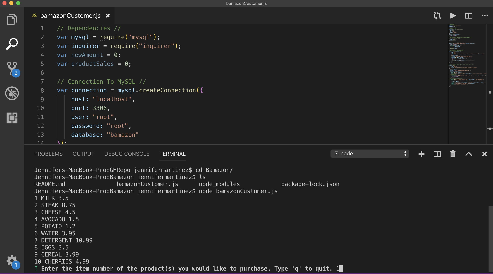

# Bamazon
**An Amazon-like storefront utilizing Node.js and MySQL.**

https://github.com/JennMartinez/Bamazon.git

Bamazon is a storefront that allows the user to place an order from a list of products, working from the command line, utilizing node.js and connecting to the MySQL database. 

The list of products in Bamazon are located in the MySQL database, which in turn displays the product id, product, and price.

Once the list of products is displayed, the user will be prompted by, 

    "Enter the item number of the product you would like to purchase. Type 'q' to quit." 

The item chosen will then appear on the command line.

Once the item number for the product is entered, the user is then prompted by,

    "Enter the quantity of each item that you would like to purchase."
    
When the quantity is inputed, the database will respond and display, the product id, product, department, price, and quantity.

The database will then check the system if Bamazon can fulfill the requested order based on inventory displaying the quantity available and the requested quantity by the user. 

If the product and quantity chosen is **in stock**, the command line will display how much quantity of which product will be purchased, and the total amount that is due for the purchase.

If the product and quantity chosen is **not in stock**, the command line will display that Bamazon is out of stock, and will be restocked shortly. 

Below are screenshots of the different commands, which will provide a visual step-by-step process of how Bamazon can be utilized:

